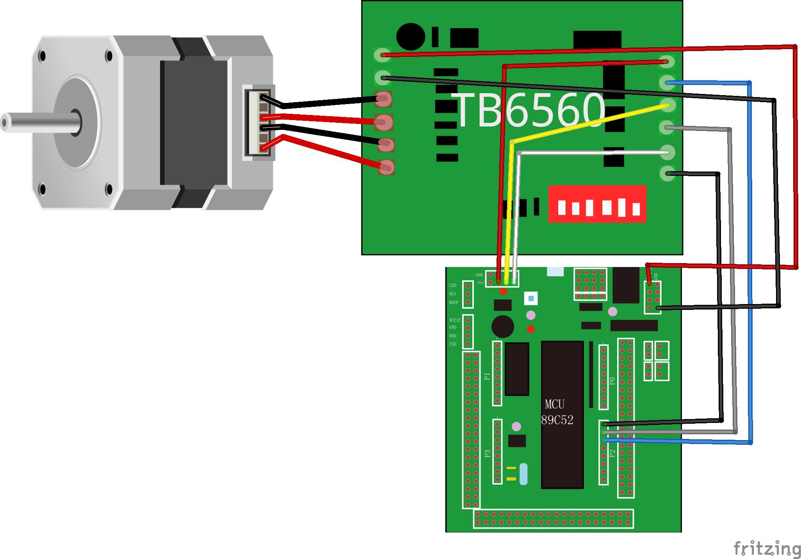

# TB6560
简介：使用TB6560控制步进电机。先禁止后使能，然后再先正转后反转。  
使用端口：`P2.5`,`P2.6`,`P2.7`  

序号 | 单片机端口 | TB6560端口
---- | --------- | ------
1 | `VCC`  | `EN+` 
2 | `VCC`  | `CW+` 
3 | `VCC`  | `CLK+` 
4 | `P2.7` | `EN-` 
5 | `P2.6` | `CW-` 
6 | `P2.5` | `CLK-` 
7 | `Vin`   | `+24V` 
8 | `GND`  | `GND` 

  